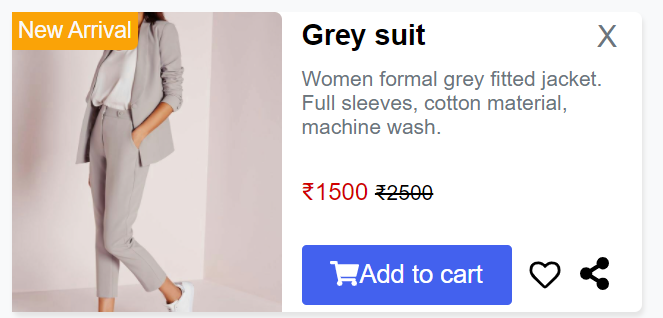

# FALCON UI

Falcon UI is a Component Library that helps you build faster and better projects.

## Installation

For using the components in your projects, copy and paste the stylesheet `<link>` in your `<head>` in your `html` file. Make sure to copy-paste this stylesheet before all the other styles.

```html
<link rel="stylesheet" href="https://falcon-ui-zoya.netlify.app/styles.css" />
```

---

# Components in the Falcon UI Library

- [Alert](#alert)
- [Avatar](#avatar)
- [Badge](#badge)
- [Button](#button)
- [Card](#card)
- [Image](#image)
- [Input](#input)
- [Modal](#modal)
- [Rating](#rating)
- [Text Utilities](#text-utilities)

---

## Alert

An alert is used to tell the user any important message. It is short and is used to draw user's attention.
It has 5 types: primary, secondary, success, danger, warning.

1. Alert
   

2. Outlined Alert
   

### [Checkout code for Alert](https://falcon-ui-zoya.netlify.app/components/alert/alert.html)

---

## Avatar

Avatar can be used to show the user's identity on screen.
It has 2 types: round avatar and square avatar.

1. Round Avatar
   

2. Square Avatar
   

### [Checkout code for Avatar](https://falcon-ui-zoya.netlify.app/components/avatar/avatar.html)

---

## Badge

Badge on avatar shows the current state of the user (online, offline or disabled) on any app . It has left and right positions.
There are four sizes of badges: xlg, lg, md and sm.

1. Badge on Avatar
   

2. Badge on Icons
   

### [Checkout code for Badge](https://falcon-ui-zoya.netlify.app/components/badge/badge.html)

---

## Button

Buttons are also called as call to action.
Listed below are certain types of buttons:

1. Contained Button
   

2. Outlined Button
   

3. Link Button
   

4. Icon Button
   

5. Floating Action Button
   

### [Checkout code for Button](https://falcon-ui-zoya.netlify.app/components/button/button.html)

---

## Card

Cards are used to display short and crisp information to the user.

1. Vertical Card


2. Horizontal Card





### [Checkout code for Card](https://falcon-ui-zoya.netlify.app/components/card/card.html)

---

## Image

Image can be used to display pictures on the website.

1. Rounded Image


2. Square Image


3. Responsive Image


### [Checkout code for Image](https://falcon-ui-zoya.netlify.app/components/image/image.html)

---

## Input

Inputs are used to take the information typed by the user.

1. Textarea


2. Label Input


3. Placeholder Input


### [Checkout code for Input](https://falcon-ui-zoya.netlify.app/components/input/input.html)

---

## Modal

Modals are positioned over everything else in the document and remove scroll from the page.


### [Checkout code for Modal](https://falcon-ui-zoya.netlify.app/components/modal/modal.html)

---

## Rating

Ratings are represented in icons and the users use these to give rating to the services they received.


### [Checkout code for Rating](https://falcon-ui-zoya.netlify.app/components/rating/rating.html)

---

## Text Utilities

1. Headings
   

2. Paragraphs
   

3. Other styles
   

### [Checkout code for Text Utilities](https://falcon-ui-zoya.netlify.app/components/typography/typography.html)

---

<div align="center" >

## Check out the [DOCUMENTATION](https://falcon-ui-zoya.netlify.app/index.html) for more information.

</div>
